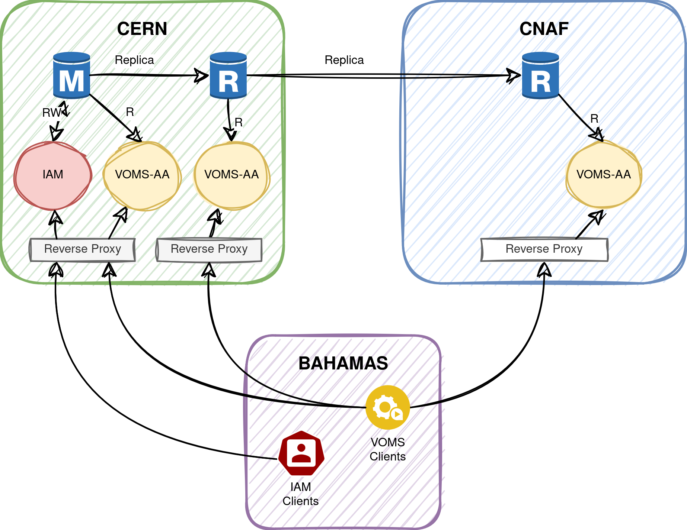

# VOMS-AA Replica

This folder contains a docker compose example to deploy three instances of VOMS-AA in two sites with a DB replica.



With this setup the VOMS-AA service can be replicated on one or more remote locations. If one location fails or is overloaded, a VOMS client can connect to the other locations.

## Deployment description

The `compose` file definises a few containers:

* `trust`: docker image for the GRID CA certificates plus the `igi-test-ca` used in this deployment for test certificates.

The actual VOMS services are virtually divided between three sites:

#### Site 1: CERN
* `db-primary`: a dump of the IAM db for test environment. In addition to the db populated with the iam `mysql-dev` profile, the user `test` has a certificate with DN `/C=IT/O=IGI/CN=test0` linked to his account and he also is part of the `indigo-dc` group (necessary to obtain VOMS proxies). A second SQL script creates a `replicator` user for replica.
* `db-replica`: a DB configured to replicate the statements of `db-primary`, from the initial one. It conects with SSL and is configured to be read-only. Only the IAM DB tables which are used by VOMS-AA are replicated. You can see them [here](assets/mysql-conf/replica.cnf).
* `vomsaa-primary` and `vomsaa-replica`: the main voms-aa microservices, each connected to their own DB.
* `ngx-primary` and `ngx-replica`: an extension to NGINX, used for TLS termination, reverse proxy and possibly VOMS proxies validation. They sends requests to the corresponding `vomsaa-primary` and `vomsaa-replica` services.


#### Site 2: CNAF
* `db-remote`: this is a full replica of `db-replica`. Only the tables used by VOMS-AA are present in `db-replica`, and thus we avoiding transmitting over the remote network useless information.
* `vomsaa-remote`
* `ngx-remote`

#### Site 3: Anywhere else
* `client`: it is a single container containing GRID clients (in particular `voms-proxy-init`) used to query both the VOMS services. It connects in round-robin fashion to each endpoint and when one fails it falls back to the others. Here a p12 file for the test user encrypted with the `pass` password is present in the well-known directory (`/home/test/.globus/usercred.p12`). It can be used to obtain a VOMS proxy by `voms-aa` serving a VO named `indigo-dc`.

### Networking

We use a few distinct networks, similar to a real scenario:

* `site1-lan` and `site2-lan`: The internal LAN of the two sites. These are used to connect the DB, VOMS-AA and NGINX between them inside the same site.
* `site-to-site-tunnel`: This is a VPN network or any tunnel network between the two sites, used by `db-remote` to connect to `db-replica`.
* `wan`: The NGINX servers are exposed on the public network so that the clients can connect from anywhere.

## Test

Run the docker-compose with

```
$ docker compose up -d
```

and wait for the `trust` service to finish; all the services will be available shortly afterwards.

To query the voms-aa using the VOMS client, run:

``` 
$ docker compose exec client voms-proxy-init -voms indigo-dc
Enter GRID pass phrase for this identity:
Contacting voms-remote.test.example:443 [/C=IT/O=IGI/CN=*.test.example] "indigo-dc"...
Remote VOMS server contacted succesfully.


Created proxy in /tmp/x509up_u1000.

Your proxy is valid until Sat Mar 16 03:54:38 CET 2024
```

Check the content of the proxy with

```
$ docker compose exec client voms-proxy-info -all
subject   : /C=IT/O=IGI/CN=test0/CN=441572696
issuer    : /C=IT/O=IGI/CN=test0
identity  : /C=IT/O=IGI/CN=test0
type      : RFC3820 compliant impersonation proxy
strength  : 2048
path      : /tmp/x509up_u1000
timeleft  : 11:59:45
key usage : Digital Signature, Non Repudiation, Key Encipherment
=== VO indigo-dc extension information ===
VO        : indigo-dc
subject   : /C=IT/O=IGI/CN=test0
issuer    : /C=IT/O=IGI/CN=*.test.example
attribute : /indigo-dc/Role=NULL/Capability=NULL
timeleft  : 11:59:45
uri       : voms-remote.test.example:8080

```
If you want to force the query to one voms-aa use one of the followings:
```
$ docker compose exec client voms-proxy-init -voms voms-primary
$ docker compose exec client voms-proxy-init -voms voms-replica
$ docker compose exec client voms-proxy-init -voms voms-remote
```

To run the testsuite:
```
$ docker compose exec testsuite bash run-testsuite.sh
```